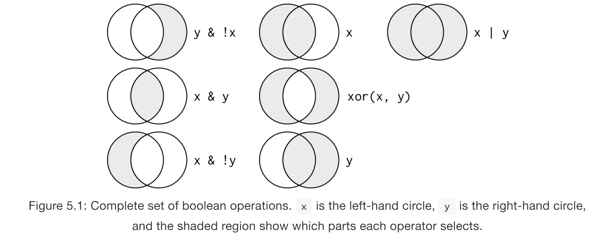

# Workshop Logistics

## About Me
- I'm an Assistant Professor in the College of Education
    + I enjoy model building, particularly longitudinal models, and statistical programming.
- I've used R for over 10 years.
    + I have 4 R packages, 3 on CRAN, 1 on GitHub, a few more in development.
        * simglm
        * pdfsearch
        * highlightHTML
        * SPSStoR
- GitHub Repository for this workshop: <https://github.com/lebebr01/iowa_data_science>

## Why teach the tidyverse
- The tidyverse is a series of packages developed by Hadley Wickham and his team at RStudio. <https://www.tidyverse.org/>
- I teach/use the tidyverse for 3 major reasons:
    + Simple functions that do one thing well
    + Consistent implementations across functions within tidyverse (i.e. common APIs)
    + Provides a framework for data manipulation
    
    
## PSQF 6250
- Small plug for my online course
- <https://myui.uiowa.edu/my-ui/courses/details.page?id=875209&ci=148839>


# Introduction to Tidyverse -- Graphics

## Course Setup
```{r setup_chunks, echo = FALSE}
knitr::opts_chunk$set(fig.width=12, fig.height=6, fig.cap = NULL) 
```

```{r setup, message = FALSE, eval = FALSE}
install.packages("tidyverse")
```

```{r library}
library(tidyverse)
```

## Explore Data
```{r data, echo = FALSE, results = 'asis'}
DT::datatable(midwest)
```

## First ggplot
```{r plot1}
ggplot(data = midwest) +
  geom_point(mapping = aes(x = popdensity, y = percollege))
```

## Equivalent Code
```{r plot1_reduced}
ggplot(midwest) +
  geom_point(aes(x = popdensity, y = percollege))
```

## Your Turn
1. Try plotting `popdensity` by `state`.
2. Try plotting `county` by `state`. 
    + Does this plot work?
3. Bonus: Try just using the `ggplot(data = midwest)` from above. 
    + What do you get? 
    + Does this make sense?

## Add Aesthetics
```{r aesthetic}
ggplot(midwest) +
  geom_point(aes(x = popdensity, y = percollege, color = state))
```

## Global Aesthetics
```{r global_aes}
ggplot(midwest) +
  geom_point(aes(x = popdensity, y = percollege), color = 'pink')
```

## Your Turn
1. Instead of using colors, make the shape of the points different for each state.
2. Instead of color, use `alpha` instead. 
    + What does this do to the plot?
3. Try the following command: `colors()`. 
    + Try a few colors to find your favorite.
4. What happens if you use the following code:
```{r glob_aes, fig.show = 'hide'}
ggplot(midwest) + 
  geom_point(aes(x = popdensity, y = percollege, color = 'green'))
```

## Additional Geoms
```{r smooth, message = FALSE}
ggplot(midwest) +
  geom_smooth(aes(x = popdensity, y = percollege))
```

## Add more Aesthetics
```{r smooth_states, message = FALSE}
ggplot(midwest) +
  geom_smooth(aes(x = popdensity, y = percollege, linetype = state), 
              se = FALSE)
```

## Your Turn
1. It is possible to combine geoms, which we will do next, but try it first. Try to recreate this plot.
```{r combine, echo = FALSE, message = FALSE}
ggplot(midwest) +
  geom_point(aes(x = popdensity, y = percollege, color = state)) +
  geom_smooth(aes(x = popdensity, y = percollege, color = state), 
              se = FALSE)
```

## Layered ggplot
```{r combine_geoms, message = FALSE}
ggplot(midwest) +
  geom_point(aes(x = popdensity, y = percollege, color = state)) +
  geom_smooth(aes(x = popdensity, y = percollege, color = state), 
              se = FALSE)
```

## Remove duplicate aesthetics
```{r two_geoms, message = FALSE}
ggplot(midwest, 
       aes(x = popdensity, y = percollege, color = state)) +
  geom_point() +
  geom_smooth(se = FALSE)
```

## Your Turn
1. Can you recreate the following figure?
```{r differ_aes, message = FALSE, echo = FALSE}
ggplot(midwest, aes(x = popdensity, y = percollege)) +
  geom_point(aes(color = state)) +
  geom_smooth(se = FALSE)
```

## Brief plot customization
```{r breaks_x, eval = FALSE}
ggplot(midwest, 
       aes(x = popdensity, y = percollege, color = state)) +
  geom_point() + 
  scale_x_continuous("Population Density", 
                     breaks = seq(0, 80000, 20000)) + 
  scale_y_continuous("Percent College Graduates") + 
  scale_color_discrete("State")
```

## Brief plot customization Output
```{r breaks_x2, echo = FALSE}
ggplot(midwest, 
       aes(x = popdensity, y = percollege, color = state)) +
  geom_point() + 
  scale_x_continuous("Population Density", 
                     breaks = seq(0, 80000, 20000)) + 
  scale_y_continuous("Percent College Graduates") + 
  scale_color_discrete("State")
```

## Add in plot title and subtitle
```{r, ggplottitle, eval = FALSE}
ggplot(midwest, 
       aes(x = popdensity, y = percollege, color = state)) +
  geom_point() + 
  scale_x_continuous("Population Density", 
                     breaks = seq(0, 80000, 20000)) + 
  scale_y_continuous("Percent College Graduates") + 
  scale_color_discrete("State") + 
  labs(title = "Percent College Educated by Population Density",
       subtitle = "County level data for five midwest states")
```

## Add in plot title and subtitle Output
```{r, ggplottitleout, echo = FALSE}
ggplot(midwest, 
       aes(x = popdensity, y = percollege, color = state)) +
  geom_point() + 
  scale_x_continuous("Population Density", 
                     breaks = seq(0, 80000, 20000)) + 
  scale_y_continuous("Percent College Graduates") + 
  scale_color_discrete("State") + 
  labs(title = "Percent College Educated by Population Density",
       subtitle = "County level data for five midwest states")
```

## Additional ggplot2 resources
+ ggplot2 website: <http://docs.ggplot2.org/current/index.html>
+ ggplot2 book: <http://www.springer.com/us/book/9780387981413>
+ R graphics cookbook: <http://www.cookbook-r.com/Graphs/>


# R Basics

## R works as a calculator
```{r calc}
1 + 2 - 3
5 * 7
2/1
```

## R Calculator 2
```{r calc2}
sqrt(4)
2^2
```


## Can save objects to use later
```{r object}
x <- 1 + 3
x
```

```{r object2}
x * 3
```

## R is case sensitive
```{r case, error = TRUE}
case_sensitive <- 10
Case_sensitive
```

## R Functions
```{r rnorm}
set.seed(1)
rnorm(n = 5, mean = 0, sd = 1)
```
```{r rnorm2}
set.seed(1)
rnorm(5, 0, 1)
```
```{r rnorm3}
set.seed(1)
rnorm(sd = 1, n = 5, mean = 0)
```

## Working through Errors
1. Use `?function_name` to explore the details of the function. The examples at the bottom of every R help page can be especially helpful.
    + <https://www.rdocumentation.org/> provided by DataCamp is a great alternative as well.
2. If this does not help, copy and paste the error and search on the internet.


# Using `dplyr` for data manipulation

## `dplyr` basics
The `dplyr` package uses verbs for common data manipulation tasks. These include:

- `filter()`
- `count()`
- `arrange()`
- `select()`
- `mutate()`
- `summarise()`

## Data
<https://fivethirtyeight.com/features/both-republicans-and-democrats-have-an-age-problem/>

```{r fivethirtyeight, eval = FALSE}
install.packages('fivethirtyeight')
library(fivethirtyeight)
```

```{r congress, echo = FALSE}
library(fivethirtyeight)
DT::datatable(congress_age[1:100, ])
```


## Using `filter`
```{r 80th}
filter(congress_age, congress == 80)
```

## Save filtered results to object
```{r 80th_save}
congress_80 <- filter(congress_age, congress == 80)
```

## Other operators for numbers
- `>`
- `<`
- `>=`
- `<=`

## Your Turn
1. Select all rows where the congress member was older than 80 at the start of the term.
2. Use the `is.na` function to identify congress members that have missing middlenames.

## Filter character variables
```{r senate}
senate <- filter(congress_age, chamber == 'senate')
```

## Combine Operations - AND
```{r 80senate}
filter(congress_age, congress == 80, chamber == 'senate')
```

## Equivalent AND Statement
```{r 80senate2}
filter(congress_age, congress == 80 & chamber == 'senate')
```

## Filter - OR
```{r filter_or}
filter(congress_age, congress == 80 | congress == 81)
```

## `%in%`
```{r filter_2}
filter(congress_age, congress %in% c(80, 81))
```

## Not Operator
```{r not_80}
filter(congress_age, congress != 80)
```

## Not Operator 2
```{r 80_notsenate}
filter(congress_age, congress == 80 & !chamber == 'senate')
```

## Working with logicals
```{r logicals}
filter(congress_age, incumbent)
```

## Your Turn
1. Select the Senators from Iowa.
2. Select the Senators from Iowa that are not inbumbents.

## All boolean options


## Using `count`
```{r count}
count(congress_age, party)
count(congress_age, incumbent)
```

## Using `arrange`
```{r simple_arrange}
arrange(congress_age, state)
```

## Add more variables
```{r two_arrange}
arrange(congress_age, state, party)
```

## Descending Order
```{r descend}
arrange(congress_age, desc(congress))
```

## Your Turn
1. Count the number of congress members from each party that are older than 80 at term start.
2. Arrange the result from above by the variable n.

## Using `select`
```{r select}
select(congress_age, congress, chamber, party, age)
```

## Helper functions
- `starts_with()`
- `ends_with()`
- `contains()`
- `matches()`
- `num_range()`
- `:`
- `everything()`

## `starts_with` helper
```{r starts_with}
select(congress_age, starts_with('s'))
```

## Contains helper
```{r contains}
select(congress_age, contains('name'))
```

## Colon
```{r colon}
select(congress_age, congress:birthday)
```

## Drop variables
```{r drop}
select(congress_age, -firstname, -state, -party, -incumbent, -chamber)
```

## Reorder with `everything`
```{r reorder}
select(congress_age, congress, chamber, incumbent, age, everything())
```

## `rename` function
```{r rename}
rename(congress_age, first_name = firstname, last_name = lastname)
```

## Your Turn
1. Using the `dplyr` helper functions, select all the variables that start with the letter 'c'.
2. Rename the first three variables in the congress data to 'x1', 'x2', 'x3'.
3. After renaming the first three variables, use this new data (ensure you saved the previous step to an object) to select these three variables with the `num_range` function.

## Using `mutate`
```{r mutate, error = FALSE}
congress_red <- select(congress_age, congress, chamber, state, party)

mutate(congress_red, 
       democrat = ifelse(party == 'D', 1, 0),
       num_democrat = sum(democrat)
       )
```

## Your Turn
1. Using the `diamonds` data, use `?diamonds` for more information on the data, use the `mutate` function to calculate the price per carat. Hint, this operation would involve standardizing the price variable so that all are comparable at 1 carat.
2. Using `mutate`, calculate the rank of the original price variable and the new price variable calculated above using the `min_rank` function. Are there differences in the ranking of the prices?

## Using `summarise`
```{r summarise}
congress_2 <- mutate(congress_age, 
       democrat = ifelse(party == 'D', 1, 0)
       )

summarise(congress_2, 
          num_democrat = sum(democrat)
          )
```

## `group_by`
```{r group_by}
congress_grp <- group_by(congress_2, congress)

summarise(congress_grp, 
          num_democrat = sum(democrat),
          total = n(),
          prop_democrat = num_democrat / total
)
```

## Explore trend
```{r trend, eval = FALSE}
num_dem <- summarise(congress_grp, 
                     num_democrat = sum(democrat),
                     total = n(),
                     prop_democrat = num_democrat / total
)
ggplot(num_dem, aes(x = congress, y = prop_democrat)) + 
  geom_line()
```

## Explore trend output
```{r trend2, echo = FALSE}
num_dem <- summarise(congress_grp, 
                     num_democrat = sum(democrat),
                     total = n(),
                     prop_democrat = num_democrat / total
)
ggplot(num_dem, aes(x = congress, y = prop_democrat)) + 
  geom_line()
```

## Your Turn
1. Suppose we wanted to calculate the number and proportion of republicans instead of democrats, assuming these are the only two parties, edit the `summarise` command above to calculate these values. 
2. Suppose instead of using `sum(democrat)` above, we used `mean(democrat)`, what does this value return? Why does it return this value?


## `group_by` with `mutate`
```{r mutate_group, eval = FALSE}
congress_red <- select(congress_age, congress, chamber, state, party)
congress_grp <- group_by(congress_red, congress)

mutate(congress_grp, 
       democrat = ifelse(party == 'D', 1, 0),
       num_democrat = sum(democrat),
       total = n(),
       prop_democrat = num_democrat / total
)
```

## `group_by` with `mutate` output
```{r mutate_group2, echo = FALSE}
congress_red <- select(congress_age, congress, chamber, state, party)
congress_grp <- group_by(congress_red, congress)

mutate(congress_grp, 
       democrat = ifelse(party == 'D', 1, 0),
       num_democrat = sum(democrat),
       total = n(),
       prop_democrat = num_democrat / total
)
```

## Chaining operations
```{r chain_difficult, eval = FALSE}
summarise(
  group_by(
    mutate(
      filter(
        congress_age, congress >= 100
      ), 
      democrat = ifelse(party == 'D', 1, 0)
    ),
    congress, chamber
  ),
  num_democrat = sum(democrat),
  total = n(),
  prop_democrat = num_democrat / total
)
```

## The pipe `%>%` is the answer
```{r pipe, eval = FALSE}
congress_age %>%
  filter(congress >= 100) %>%
  mutate(democrat = ifelse(party == 'D', 1, 0)) %>%
  group_by(congress, chamber) %>%
  summarise(
    num_democrat = sum(democrat),
    total = n(),
    prop_democrat = num_democrat / total
  )
```

## The two are identical
```{r identical}
pipe_congress <- congress_age %>%
  filter(congress >= 100) %>%
  mutate(democrat = ifelse(party == 'D', 1, 0)) %>%
  group_by(congress, chamber) %>%
  summarise(
    num_democrat = sum(democrat),
    total = n(),
    prop_democrat = num_democrat / total
  )

nested_congress <- summarise(
  group_by(
    mutate(
      filter(
        congress_age, congress >= 100
      ), 
      democrat = ifelse(party == 'D', 1, 0)
    ),
    congress, chamber
  ),
  num_democrat = sum(democrat),
  total = n(),
  prop_democrat = num_democrat / total
)

identical(pipe_congress, nested_congress)
```


## Your Turn
1. Look at the following nested code and determine what is being done. Then translate this code to use the pipe operator.
```{r code_pipe_examp, eval = FALSE}
summarise(
  group_by(
    mutate(
      filter(
        diamonds, 
        color %in% c('D', 'E', 'F') & cut %in% c('Fair', 'Good', 'Very Good')
      ),
      f_color = ifelse(color == 'F', 1, 0),
      vg_cut = ifelse(cut == 'Very Good', 1, 0)
    ),
    clarity
  ),
  avg = mean(carat),
  sd = sd(carat),
  avg_p = mean(price),
  num = n(),
  summary_f_color = mean(f_color),
  summary_vg_cut = mean(vg_cut)
)
```

## Other Useful dplyr functions
There are a set of functions that can greatly simplify data operations. These functions end with:

+ `*_if` 
+ `*_each` 
+ `*_all`
+ `*_at`

## Simple example
```{r rename_if}
rename_if(congress_age, is.character, toupper)
```

## More realistic example
```{r summarise_if}
starwars %>%
  group_by(species, gender) %>%
  summarise_if(is.numeric, mean, na.rm = TRUE)
```

## Can call more than one function
```{r summarise_if2}
starwars %>%
  group_by(species, gender) %>%
  summarise_if(is.numeric, funs(mean, median), na.rm = TRUE) %>%
  add_tally()
```

# Data Import

## Read in your own data
- We will use data posted to GitHub: <https://github.com/lebebr01/iowa_data_science/tree/master/data>

## Data Import
```{r ufo_read}
ufo <- read_csv("https://raw.githubusercontent.com/lebebr01/iowa_data_science/master/data/ufo.csv")
```

## Show Data
```{r ufo_data}
ufo
```

## Manual column names
```{r ufo_manual_names}
ufo_man <- read_csv("https://raw.githubusercontent.com/lebebr01/iowa_data_science/master/data/ufo.csv", 
         skip = 1, 
         col_names = c('Date/Time', 'City', 'State', 
                       'Shape', 'Duration', 'Summary',
                       'Posted'))
```

## Manual column names output
```{r ufo_output}
ufo_man
```

## Manual column types
```{r date_time2}
ufo_date <- read_csv("Data/ufo.csv", 
         col_types = list(
           'Date / Time' = col_datetime(format = "%m/%d/%y %H:%M"),
           City = col_character(),
           State = col_character(),
           Shape = col_character(),
           Duration = col_character(),
           Summary = col_character(),
           Posted = col_character()
         ))
```

## Manual column types output
```{r ufo_types}
ufo_date
```

## Still problems
```{r problems}
problems(ufo_date)
```

## Other text formats
- tsv - tab separated files - `read_tsv`
- fixed width files - `read_fwf`
- white space generally - `read_table`
- delimiter generally - `read_delim`

## Your Turn
1. There is a tsv file posted on icon called "lotr_clean.tsv". Download this and read this data file into R. 
2. Instead of specifying the path, use the function `file.choose()`. For example, `read_tsv(file.choose())`. 
    + What does this function do? 
    + Would you recommend this to be used in a reproducible document?
    
## Excel Files
```{r readxl, eval = FALSE}
install.packages('readxl')
```

## `read_excel`
```{r read_excel}
library(readxl)
read_excel('data/titanic.xlsx')
```

## Write Output Files
```{r write, eval = FALSE}
ufo_count <- ufo %>%
  group_by(State) %>%
  mutate(num_state = n())

write_csv(ufo_count, path = 'path/to/save/file.csv')
```

## Additional Resources
+ R for Data Science: <http://r4ds.had.co.nz/>


# Thank You!
